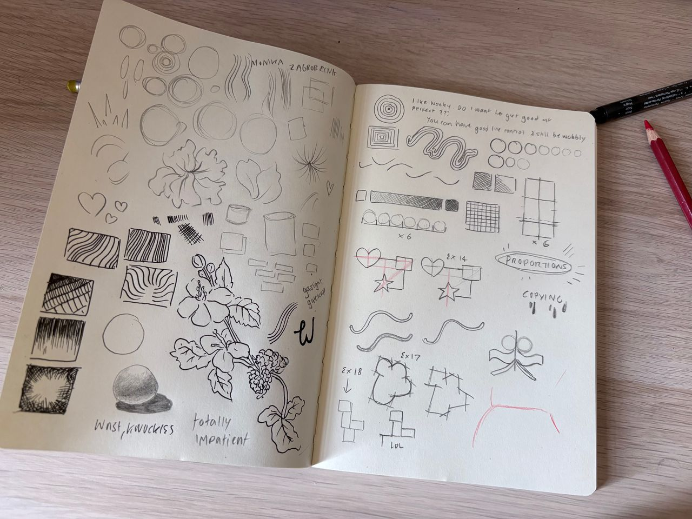
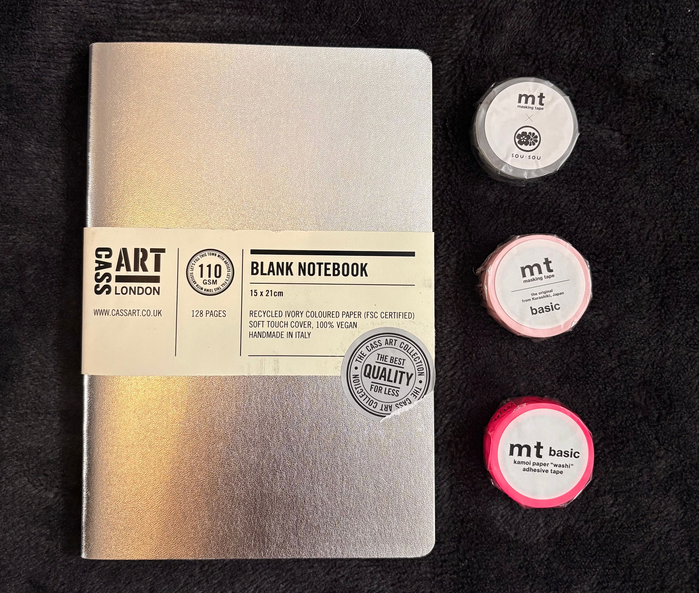
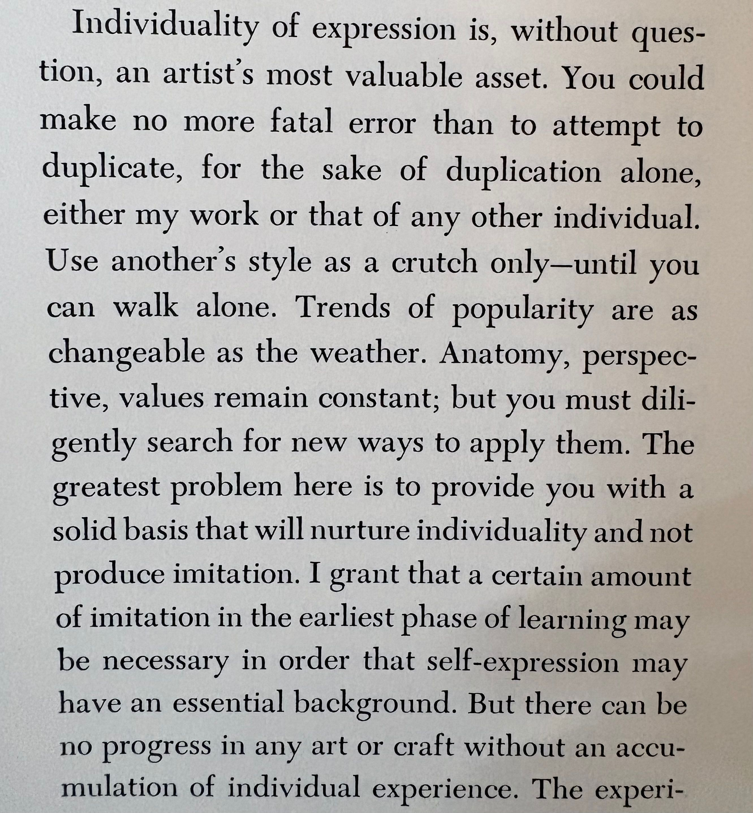
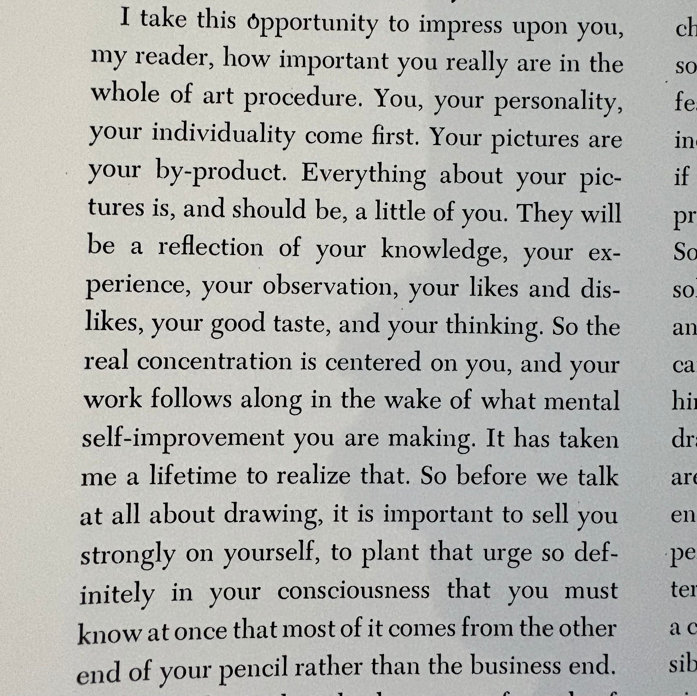

## Drawing Practice

I am trying to practice drawing more :3 I've pretty much always coasted by on ignoring theory and actual sustained practice and I'm truly reaping what I've sown. 

By the way, this is my blog that [the best person in the world made!](https://emiliawil.dev/) Thank you! ♡ Doesn't it look amazing :3

<!--more-->

I decided I'd like to re-learn anatomy, but do it properly this time. Though, I actually just ended up warming up and then reading [Monika Zagrobelna's](https://monikazagrobelna.com/2020/08/09/i-want-to-draw-but-i-dont-know-how-to-start/) theory posts and trying a few of those. I found it interesting to see massive skill gaps I have manifesting through those exercises. I think that's neat!

 

I got this really nice sketchbook in Cass Art in Glasgow during our trip. To be honest I probably did not need a new sketchbook, but, I really loved this one and thought it would be good to have something I look forward to drawing in :-)

I also spent some time reading the into to Loomis' Figure Drawing For All It's Worth, as I've never actually sat down to do that. I really liked the quotes below: I thought it was quite sad to read given where we're at with AI now. But I also believe that AI has radicalised me to be more open about Art and what it should mean to people. 

