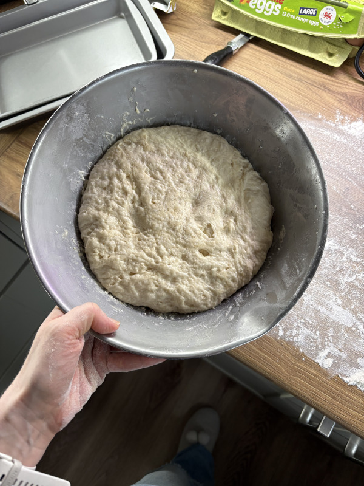
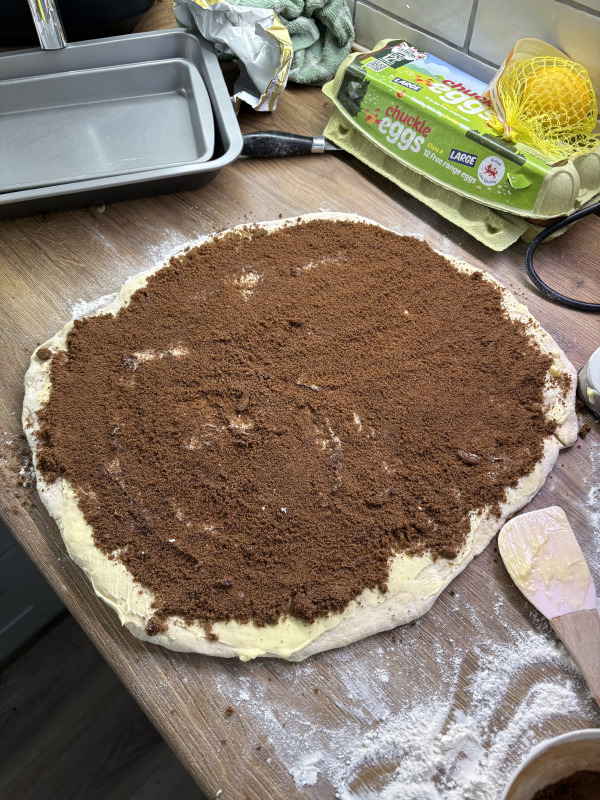
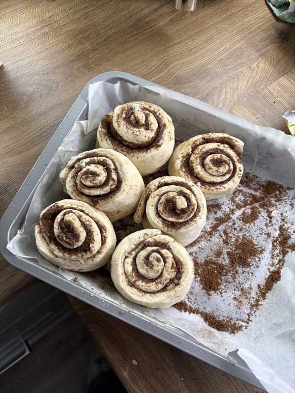
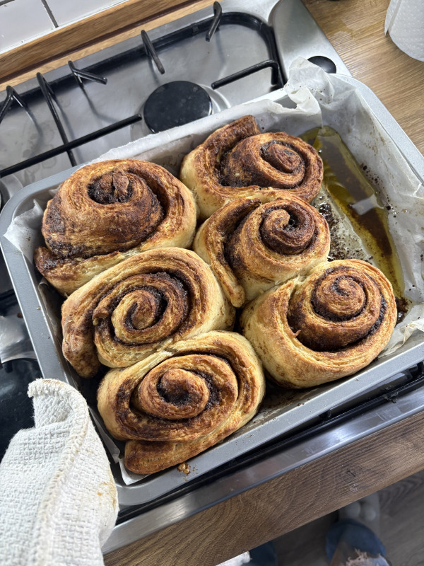
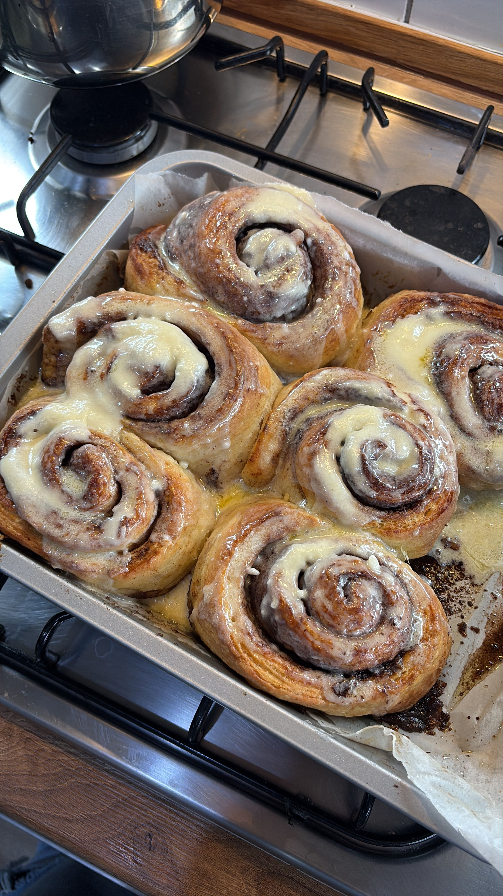
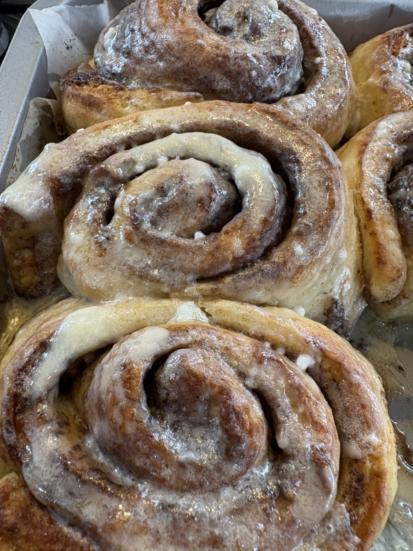
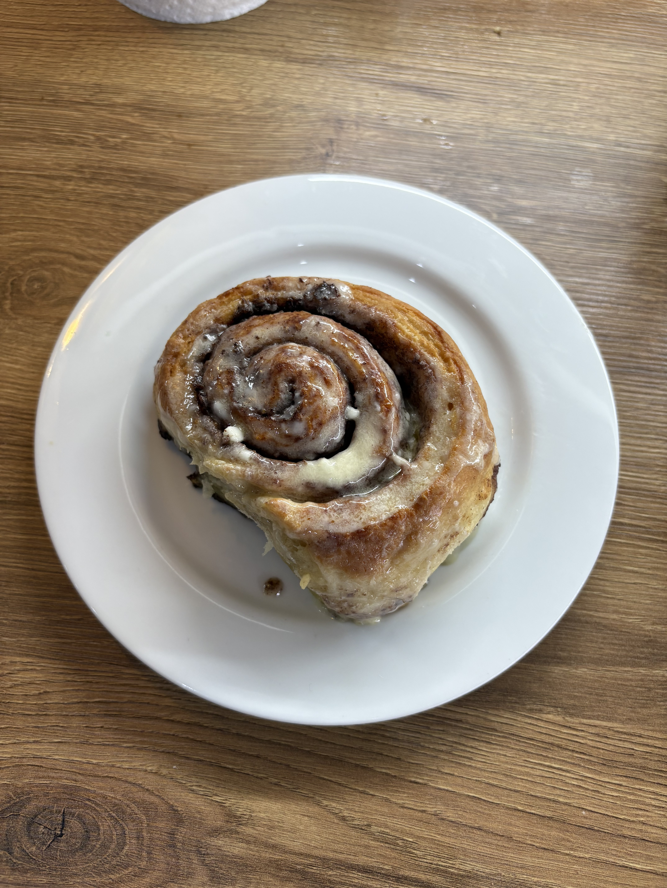
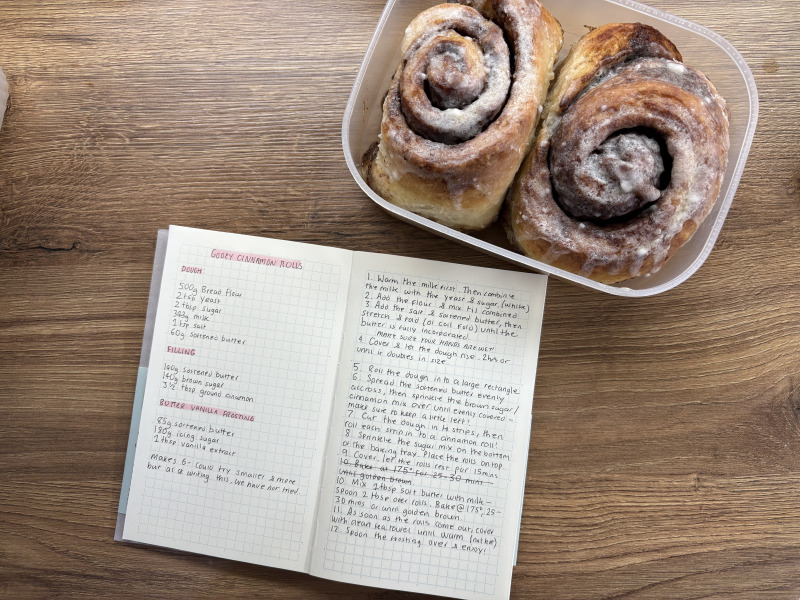

## Baking Cinnamon Rolls

I baked cinnamon rolls! I'm really happy with how they turned out :3

<!--more-->

I baked some cinnamon rolls! Historically, I have not been very good at baking this sort of thing, but these turned out so good! I didn't photograph every step, but here are some pics.

The dough! I am trying to improve my baking, working with dough is so stressful for me.

 

Spreading the brown sugar and cinnamon mixture over the dough. I realised after the dough was done bulking that I don't own a rolling pin (；￣Д￣) so I had to clean and use one of my water bottes I got from work as SWAG.... 

The rolls are ready to roll! :3

Here they are straight out of the oven. I can't believe how big they came out.....biiig boys.

In all their glory, with the frosting on and melted! They look obscene.

J and I shared one together. I'm really happy with how they came out....my favourite bit of the cinnamon swirl is the middle, because it's so gooey and soft. I have to say, that it worked out perfect! J said they are 'fucking amazing. perfect' which I took to be extremely high praise, as he's usually not afraid to point out if he thinks my bakes could do with a tweak. 

I'm so happy with them (ﾉ◕ヮ◕)ﾉ*:･ﾟ✧ 

