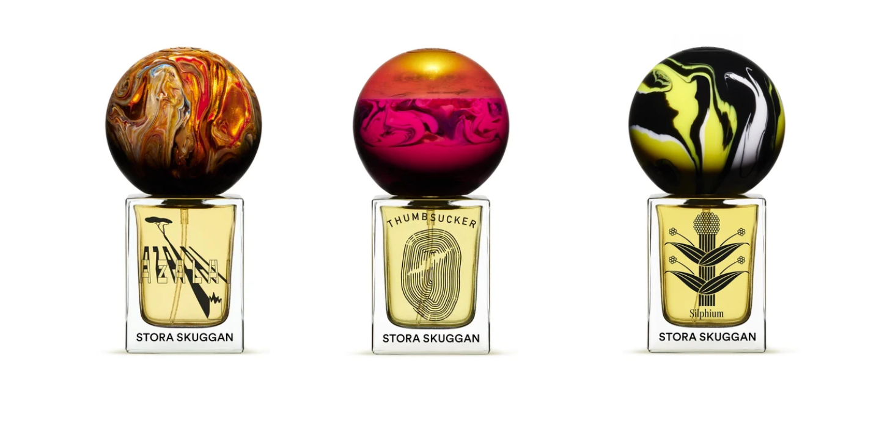
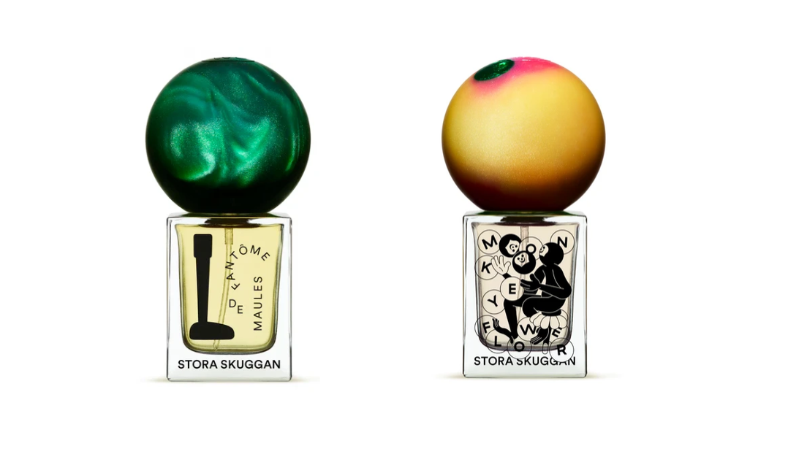
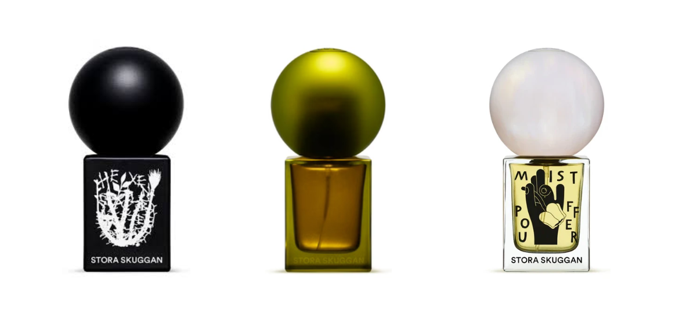

When I was in Glasgow I bought the Stora Skuggan discovery set. I have now tried all nine scents and ranked them all in order of how much I personally enjoyed each.

<!--more-->

I picked up this set becuase there were three different scents I wanted to try (Mistpouffer, Pine, and Hexensalbe) and the value for money was pretty good (´◡`) As there are nine scents, I've grouped them into top mniddle and bottom tier.
*Of course, this is all based on my nose and personal taste...which is probably not very sophisticated*

#Least favourites

Azalai, Thumbsucker, Silphium

*Azalai*
REALLY hated this one, it seemed to linger even after I scrubbed my skin of it. Extremely sickly/cloying sweet scent. Opening of blood orange and mint made my stomach turn…it settles down but not into something I found pleasant. I can not stress how much I hated this smell, if I was trapped in a room with someone who had this on I’d shit myself and shove it up my nose instead. Definitely not for me!
*Smells like*: Dried/candied fruit left out in the sun.
*Rating*: -10/10

*Thumbsucker*
This is another one that made me feel a bit ill. It’s an interesting scent. It is mysterious and warm but, again, cloying. Hard no from me. 
Smells like: 70s candle shop. Honey, wax, potpourri.
Rating: 4/10

*Silphium*
Ginger is very strong in this one, a little overwhelming for my nose. The tobacco and leather notes come in so nicely though, highly recommend to anyone looking for a spicy but fresh smell.
*Smells like:* Listening to records in a sunlit cafe on a Sunday morning, curled up on a leather sofa next to your partner. I can’t explain it, but that’s what it smells like. 
*Rating:* 5/10

#Middle Tier

*Fantôme de Maules*
Immediate open is very masc, smells exactly like the aftershave my Dad used to wear. Very quickly turns into a green bergamont-y. This is not really for me as the bergamot is really strong and I’m not a fan- but would deffo recommend for someone that wants a masc green smell. 
*Smells like:* How I imagine someone working in the visitors centre of a national park would.
Rating: 5.5/10

*Monkey Flower*
This scent has a strong ‘savoury’ floral opening if that makes sense? Definitely gets very figgy with it too: I am undecided how I feel about fig. This is a really lovely scent overall, but not one I’d particularly want to smell of myself. Also, perhaps my favourite of their bottle designs!
*Reminds me of:*  Someone on Perfume described picking a flower in the summer, and they’re right! Reminds me of playing out on really light summer evenings in the fields we used to live next to. 
Rating: 6/10

#My Favourites

*Hexensalbe*
This has quite a strong liquorice opening note. I really hate the taste and smell of liquorice so wasn’t a fan at first. But once it dries down a little, it turns into a wonderfully woody and mysterious smell…very witchy and somewhat masc.
Smells like: A witch’s cabin in a dark wood. 
Rating: 6.5/10 (would be an 8 if it weren’t for having to fight through the liquorice) 

*Pine*
This smells exactly like the only note of this perfume. Which is pine. Personally, I love the smell and I think this may be my favourite green scent I’ve tried so far. Wonderfully uncomplicated, just pine! I feel this may get some mileage out of me in Autumn.
*Smells like:*  Do I have to say
*Rating:* 7/10

Mistpouffer
Smokey bergamot opening, piney. Really love the scent this dries down into, which is sweet, smokey, subtle. Sophisticated and mysterious.
*Smells like:* Reading a book next to a foggy body of water, fire lit. Cosy on the dry down <3
*Rating:* 7.5/10

My sample set actually came with x2 Silphiums so sadly I did not get to try Moonmilk! I might try contacting SS to see if they might be able to send me one ;0;
